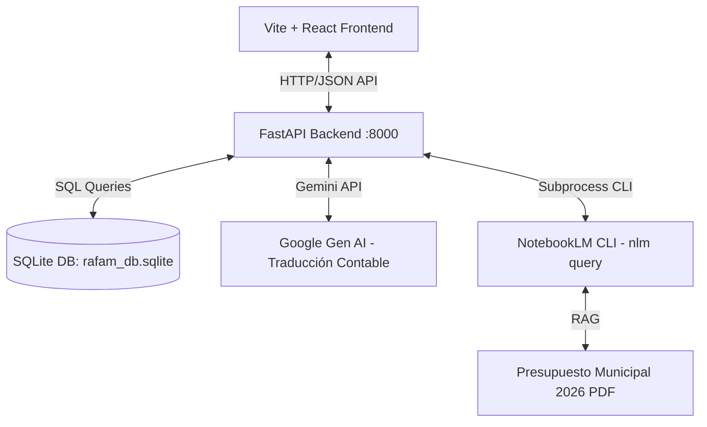

# Manual Técnico y Arquitectura - RAG RAFAM 2026

Este documento detalla la arquitectura de software, el flujo de datos, la estructura de la base de datos local y los componentes del asistente presupuestario municipal RAG RAFAM. Está orientado a desarrolladores que deseen mantener el sistema o proponer alternativas tecnológicas.

---

## 1. Arquitectura del Sistema

El sistema utiliza una arquitectura desacoplada de tres capas:



### Componentes Principales
1.  **Frontend (React/Vite)**: Interfaz de usuario enriquecida construida con React, Tailwind CSS y Lucide Icons.
2.  **Backend (FastAPI)**: Servidor Python que expone endpoints para la estructura jerárquica, detalles enriquecidos y consultas RAG.
3.  **Base de Datos Relacional (SQLite)**: Caché local de la estructura presupuestaria que evita latencias de red al navegar por el árbol.
4.  **Motor RAG (NotebookLM CLI)**: Consulta directa de documentos presupuestarios en lenguaje natural mediante el comando del sistema `nlm query`.

---

## 2. Flujo de Datos en Consultas Semánticas

Cuando se ejecuta una consulta en el chat sin un nodo activo seleccionado:

```
[Usuario escribe: "Presupuesto escuelas"] 
       │
       ▼
[asistente_rafam.py -> traducir_consulta_contable()]
       │   - Consulta el catálogo compacto de SQLite
       │   - Llama a Gemini (gemini-2.5-flash)
       │
       ▼
[Retorno de JSON de Enrutamiento]
       │   - jurisdiccion_codigo: "1110113000"
       │   - programa_codigo: "36"
       │   - razon_enrutamiento: "Foco en escuelas"
       │
       ▼
[Generación de Prompt Enriquecido]
       │   - Inserta la Directiva de Control Contable
       │
       ▼
[NotebookLM RAG Engine (nlm query)]
       │   - Lee el PDF del presupuesto en caliente
       │
       ▼
[Limpieza de respuesta y envío al Frontend]
```

---

## 3. Estructura de la Base de Datos Local

La base de datos SQLite `datos/rafam_db.sqlite` almacena la estructura jerárquica de cuentas públicas. Consta de las siguientes tablas:

*   **`jurisdicciones`**:
    *   `codigo` (TEXT, PK): Código oficial de 10 dígitos.
    *   `nombre` (TEXT): Nombre de la secretaría o ministerio municipal.
*   **`programas`**:
    *   `codigo` (TEXT): Código del programa presupuestario.
    *   `nombre` (TEXT): Nombre del programa.
    *   `jurisdiccion_codigo` (TEXT, FK): Relación con la jurisdicción dueña.
*   **`actividades_proyectos`**:
    *   `codigo` (TEXT): Código de actividad u obra.
    *   `nombre` (TEXT): Nombre descriptivo de la acción física.
    *   `programa_codigo` (TEXT, FK): Programa al que pertenece.
    *   `jurisdiccion_codigo` (TEXT, FK): Jurisdicción a la que pertenece.
    *   `tipo` (TEXT): Clasificador ('Actividad', 'Obra', 'Proyecto').
*   **`partidas_gasto`**:
    *   `codigo` (TEXT, PK): Partida por objeto del gasto (ej. `1.1.0`).
    *   `nombre` (TEXT): Descripción del gasto.
    *   `inciso` (TEXT): Inciso agrupador (1: Personal, 2: Bienes, etc.).
*   **`recursos_rubro`**:
    *   `codigo` (TEXT, PK): Código tributario.
    *   `nombre` (TEXT): Concepto del ingreso.

---

## 4. Archivos Clave del Código Fuente

*   `asistente_rafam.py`: Contiene las funciones de lógica pura del asistente, el traductor contable de Gemini y consultas CRUD a SQLite.
*   `servidor_rafam.py`: Define los endpoints HTTP de FastAPI y orquesta el llamado de comandos del sistema a `nlm`.
*   `scripts/sincronizar_estructura.py`: Script para regenerar la base de datos local haciendo consultas masivas de estructura a NotebookLM.
*   `src/components/Sidebar.jsx`: Componente UI del árbol contable con filtrado reactivo de abajo hacia arriba.
*   `src/components/Dashboard.jsx`: Renderiza los KPIs deterministas e interpreta el texto Markdown enriquecido devuelto por el RAG.

---

## 5. Alternativas Tecnológicas para el Desarrollo Futuro

Para los desarrolladores que piensen en alternativas evolutivas de esta arquitectura, se sugieren las siguientes vías:

### A. Migración de RAG Local (Offline)
*   **Problema actual**: El uso del CLI de NotebookLM (`nlm query`) requiere conexión a internet y depende del estado de sus servidores.
*   **Alternativa**: Reemplazar `nlm` por un RAG local utilizando una base de datos vectorial como **ChromaDB** o **FAISS**, junto con librerías como **LangChain** o **LlamaIndex** y un modelo local (ej: **Ollama + Llama3 / Qwen2.5**). Esto permitiría ejecución 100% offline y sin costos de API.

### B. Gráficos Interactivos Reales en Dashboard
*   **Problema actual**: Los KPIs de crédito y personal se generan de manera simulada mediante una semilla determinista del código del nodo para asegurar consistencia visual.
*   **Alternativa**: Modificar el prompt de traducción semántica para que devuelva un esquema JSON de datos financieros del nodo, o estructurar una base de datos SQLite con los importes históricos presupuestarios. En el frontend, implementar librerías como **Recharts** para graficar la evolución del gasto real.

### C. Reemplazo del CLI por API Directa
*   **Problema actual**: El CLI `nlm query` puede retornar bordes de caja ASCII (`│`, `╭`, `╰`) que requieren limpieza y demoran tiempos de timeout de subproceso.
*   **Alternativa**: Exponer la API de Gemini 2.5 directamente en Python usando el SDK de Google GenAI con almacenamiento en caché de contexto (`context caching`), subiendo el PDF de presupuesto como documento de sistema directamente al modelo. Esto acelerará la velocidad de respuesta de 10-15 segundos a menos de 3 segundos.
