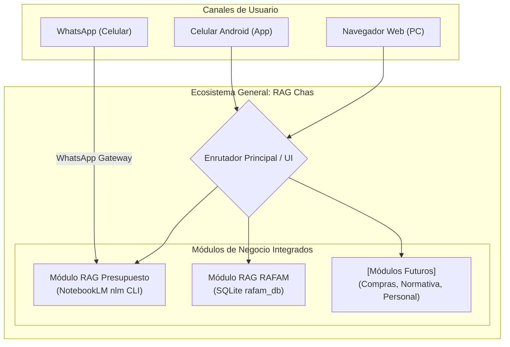

# Arquitectura Global del Ecosistema RAG Chas

Este documento define la arquitectura general de **RAG Chas**, el asistente de inteligencia artificial municipal general de Chascomús, estructurado de forma modular para permitir la incorporación incremental de nuevos módulos de gestión y control.

---

## 1. El General: RAG Chas

**RAG Chas** es el núcleo e identificador general del sistema. Contempla e integra bajo un mismo paraguas todos los módulos de inteligencia artificial de la gestión municipal, unificando las interfaces (web y WhatsApp) para interactuar con los diferentes datos y procesos oficiales.

### 🧩 Módulos Actuales

1. **RAG Presupuesto (RAGCHAS Core):**
   * **Propósito:** Responder consultas en lenguaje natural sobre los documentos del presupuesto, decretos y ordenanzas municipales utilizando **NotebookLM** y la API de Gemini.
   * **Canales:** Accesible mediante WhatsApp (comandos `RAGCHAS c [pregunta]`) y de las acciones rápidas de seguimiento de la consola web.
2. **RAG RAFAM (Módulo Contable):**
   * **Propósito:** Navegar, estructurar y auditar la base contable y presupuestaria (SQLite) en tiempo real.
   * **Componentes:** Árbol jerárquico contable, ficha de metas (Form 5), cargos de personal (Form 6) y proyectos de inversión y obras (Form 8/9).
   * **Canales:** Dashboard web interactivo en React y Consola de Chat integrada.

### 🏗️ Módulos Futuros en Planificación
La modularidad nativa de **RAG Chas** está diseñada para albergar nuevos submódulos a medida que se digitalicen y procesen nuevas fuentes de información:
* **RAG Compras y Contrataciones:** Auditoría de proveedores, licitaciones y compras directas.
* **RAG Normativas y Concejo Deliberante:** Búsqueda inteligente de ordenanzas, resoluciones e históricos normativos.
* **RAG Recursos Humanos:** Control de liquidaciones, planta de personal permanente/temporario y legajos.

---

## 2. Diagrama de Arquitectura Modular

---

## 3. Guía de Expansión (Cómo agregar nuevos módulos)

Para incorporar un nuevo módulo en el futuro, se deben seguir estos tres pasos simples sin romper lo existente:

### Paso 1: Base Documental o Relacional
* **Si es documental:** Crear una nueva carpeta de documentos en NotebookLM y registrar el nuevo ID de cuaderno en el archivo de metadatos (`cuadernos_metadata.json`).
* **Si es relacional:** Crear las tablas correspondientes en la base de datos central de SQLite (`rafam_db.sqlite`) para almacenamiento rápido.

### Paso 2: Endpoint en la API Backend
* Crear una nueva ruta en `servidor_rafam.py` (FastAPI) para resolver consultas del nuevo módulo.
* *Ejemplo:* `@app.get("/api/contrataciones")`.

### Paso 3: Integración en el Frontend
* **En el Navegador (React):** Agregar una pestaña o botón de navegación en `Navbar.jsx` para cambiar la vista central del Dashboard hacia el nuevo panel.
* **En WhatsApp (index.js):** Agregar un comando de activación rápida en `processRagchasCommand` para redirigir preguntas al nuevo cuaderno.
  * *Ejemplo:* `RAGCHAS compras [pregunta]`
